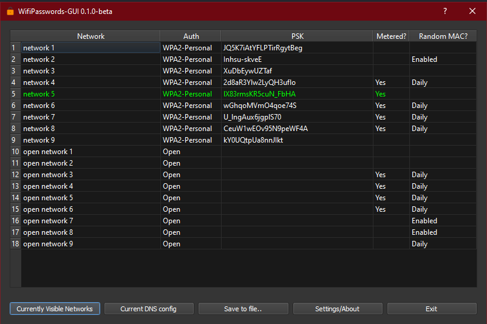

# wifipasswords-GUI

Retrieve and save all WiFi networks and passwords on the device.  

Plans for cross platform support, currently windows only.



Features
--------
- Displays all WiFi profiles on a device
- Current network is highlighted
- Can save networks as **.JSON** or **wpa_supplicant.conf** file for use on other devices
- Able to show current DNS config (Windows only at present)
- Able to show visible WiFi networks 
- Portable or installable versions
- Tested in Python 3.6 - 3.9
- Tested on Windows 10

Installation
------------
Installed with the binary files under releases.  
Portable and installer versions are supplied.  
Currently windows only.  
Binary release are signed with a self signed certificate, can also be packaged from source with below instructions. 

Usage
-----
Either run the portable exe or if installed run from the start menu.

If the source is downloaded run from the ```wifipasswordsgui.py```

Packaging as EXE
----------------
Can be packaged to a portable EXE on windows with:  
``pyinstaller --clean --noconsole --onefile -i icons8-flatcolor-unlock.ico wifipasswordsgui.py``  

Can be packaged to an EXE to a single directory on windows with:  
``pyinstaller --clean --noconsole -i icons8-flatcolor-unlock.ico wifipasswordsgui.py``  

to include the icon in the executable additional steps need to be taken.
- running pyinstaller above will create a .spec file in the current directory
- edit the .spec file and change ``datas=[]`` to ``datas=[('icons8-flatcolor-unlock.ico','.')]``
- rebuild the exe from the spec file with ``pyinstaller wifipasswordsgui.spec``
- the new executable will include the icon in the launched pyqt application

Installers are produced with innosetup.  

It is notably faster to load the program from a single directory pyinstaller output than from a onefile pyinstaller output. This is due to the QT library being decompressed to a temp dir on running the onefile variant (on each run). Use the onefile only for portable versions but for installed versions use the default single directory variant to improve load times.

To-Do
-----
- [X] Add highlighting for currently connected network
- [ ] Add macOS Support
- [ ] Add linux support
- [ ] Add automated tests
- [ ] Add settings for filename selection
- [ ] Add manual override for dark/light mode
- [ ] Add licence info on the about /settings page
- [ ] Reorganise GUI code

About
-----
Creation date: 15-01-2021
Modified date: 24-03-2021  
Dependencies: wifipasswords, PyQt5  

Icon provided by [Icon8](https://github.com/icons8/flat-color-icons) under the MIT / Good Boy licence. See project page for details.  

[wifipasswords](https://github.com/needs-coffee/wifipasswords) is release under GPLv3 on PyPi and github.  

PyQt5 is licenced under GPLv3.  

Licence
-------
Copyright (C) 2021 Joe Campbell  
 GNU GENERAL PUBLIC LICENSE (GPLv3)  

This program is free software: you can redistribute it and / or modify
it under the terms of the GNU General Public License as published by
the Free Software Foundation, either version 3 of the License, or
(at your option) any later version.

This program is distributed in the hope that it will be useful,
but WITHOUT ANY WARRANTY
without even the implied warranty of
MERCHANTABILITY or FITNESS FOR A PARTICULAR PURPOSE.  See the
GNU General Public License for more details.

You should have received a copy of the GNU General Public License
along with this program.  If not, see < https: // www.gnu.org/licenses/>.
